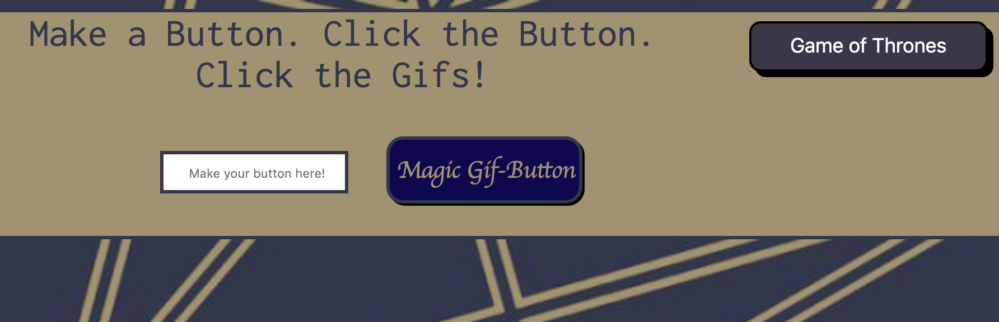

# Gif-Grab

## Quickly requesting a batch of pausable Gifs from Giphy's API endpoint.

### The user has the ability to create a button to click and bring them gifs. When they submit the button-creation-form, the javascript event adds their topic to an existing array that is dynamically turned into buttons. Each dynamic button carries the functionality to request gifs from Giphy with an ajax GET request. 

### The gifs returned are brought into a "still-state" using the API response data and then when they are clicked the source is changed to a different piece of the API data to animate it.

